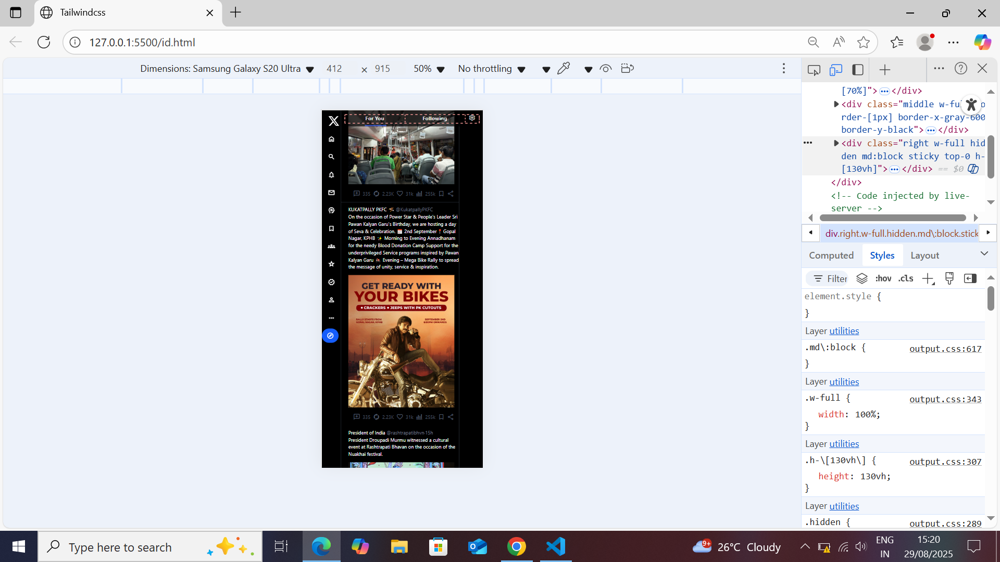

# 🐦 Twitter Clone (TailwindCSS)

A simple **Twitter clone UI** built using **HTML, CSS, and TailwindCSS**.  
This project was created as a **practice project while learning TailwindCSS**.

---

## 📈 Project Status
- ✅ Initial version: Desktop-first UI completed  
- ⏳ Upcoming: Adding responsive design for mobile  

---

## 🚀 Features
- 📱 Fully responsive layout (in progress: mobile support)
- 🎨 Built with TailwindCSS
- 🧩 Components: Navbar, Feed, Sidebar, Profile

---

## 🛠️ Tech Stack
- **HTML**
- **TailwindCSS**

---

## 📸 Screenshots

| Desktop View | Mobile View |
|--------------|-------------|
|  |  |

---

## 🔧 Setup
Clone the repo and open `index.html` in your browser:

```bash
git clone https://github.com/Kartikbilagi23/twitter-project.git
cd twitter-project
